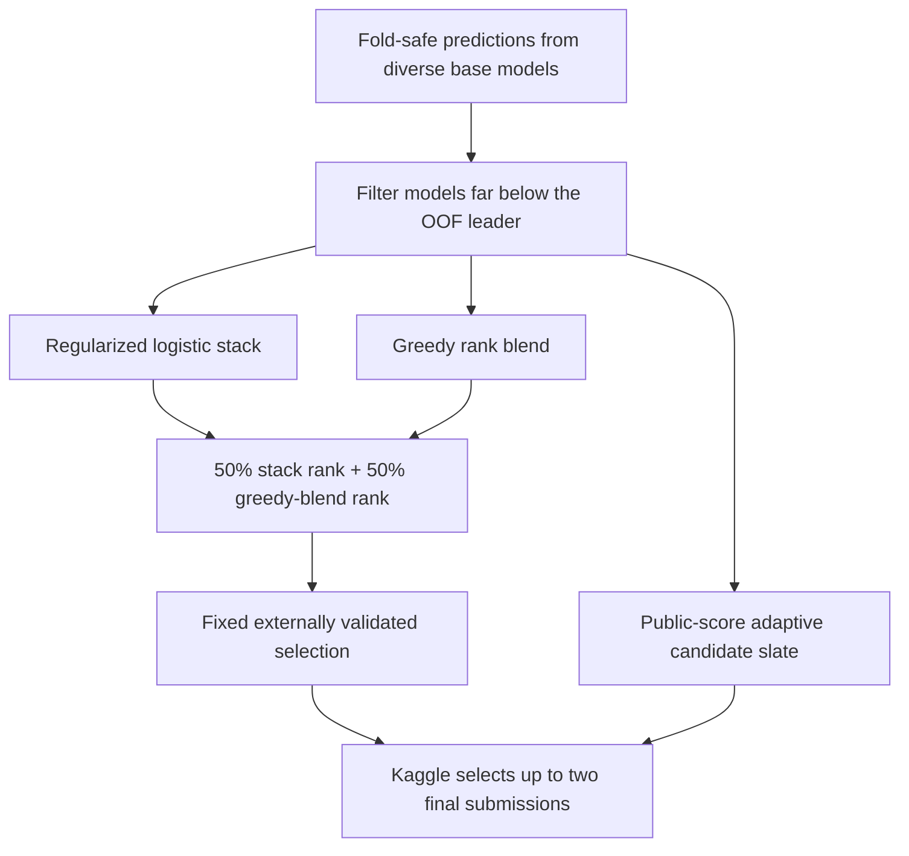

# Profile 06 — External Generalizer

This profile builds on `05_hybrid_scaled`, but its ensemble policy was selected using
unrelated held-out datasets instead of only the 16 organizer generators.

## What was tested

Five binary-classification datasets were downloaded from OpenML: Titanic, Adult,
German Credit, Phoneme, and Bank Marketing. Each was capped at 12,000 rows, split
60/40 into model-training and untouched test sets, and repeated with three
deterministic seeds. All tuning and blending used only out-of-fold predictions from
the 60% training portion. The reported ROC AUC comes from the untouched 40%.

House Prices was intentionally excluded: it is a regression problem, so its RMSE
cannot be averaged meaningfully with binary ROC AUC.

| Frozen technique | Mean test AUC | Mean rank | Test-split wins |
|---|---:|---:|---:|
| Regularized stack + rank hedge | **0.889840** | **2.67** | **5 / 15** |
| Regularized logistic stack | 0.889735 | 3.60 | 2 / 15 |
| Greedy rank blend | 0.889418 | 3.73 | 1 / 15 |
| Coarse weighted pair | 0.889634 | 4.40 | 2 / 15 |
| OOF-best individual | 0.887721 | 4.47 | 0 / 15 |
| Unguarded four-model average | 0.884212 | 5.87 | 2 / 15 |

The differences at the top are small. That is why the Kaggle agent does not bet both
final selections on stacking.



## Changes from Profile 05

- creates the regularized stack at every dataset size;
- excludes base models more than 0.03 OOF AUC below the leader before stacking;
- reduces meta-model flexibility from `C=1.0` to `C=0.35`;
- adds `blend_guarded`, which averages only competitive model families;
- combines 50% stack rank with 50% greedy-blend rank, matching the tested winner;
- fixes `stack_plus` as the robust final candidate, while public feedback chooses
  the adaptive complementary selection;
- keeps the proven first-action sample submission and exact skill API, avoiding both
  prior harness failure modes.

No external dataset, label, fitted model, or prediction is included in
`submission.zip`. External data is used only for offline technique selection.

## Reproduce

```powershell
python scripts/benchmark_external_methods.py `
  --datasets titanic adult credit_g phoneme bank_marketing `
  --repeats 3 --max-rows 12000 --output-tag methods_v2_repeats3

powershell -ExecutionPolicy Bypass -File scripts/package_submission.ps1 `
  -AgentDir submissions/06_external_generalizer/agent `
  -OutputZip submissions/06_external_generalizer/submission.zip
```
