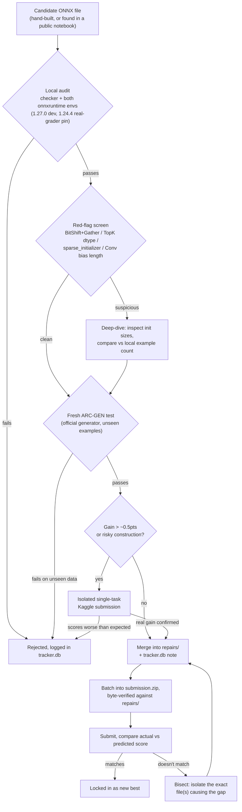

# The 2026 NeuroGolf Championship

Solutions and tooling for [NeuroGolf 2026](https://www.kaggle.com/competitions/neurogolf-2026), a Kaggle competition where you build the **smallest possible ONNX network** that solves each of 400 ARC-AGI visual reasoning tasks. Score per task is `max(1, 25 - ln(memory + params))`, and a task only counts if the network is **100% correct** on every train, test, and arc-gen example. Any mistake zeroes that task.

**Current best: 7440.82** (public leaderboard, 2026-07-16) — rank ~188/3057, bronze secured with a ~47pt margin.

New here and want to actually learn ONNX from this project rather than just read the results? Start with the interactive guide — **[live page](https://claude.ai/code/artifact/7129ab88-7cbe-435b-a181-9e9f9a4de63f)** or the same file checked into this repo at **[docs/onnx-learning-guide.html](docs/onnx-learning-guide.html)** — covering what ONNX is, how NumPy/math map onto its ops, every op family used across these 400 tasks, and the real bugs/war-stories (the Conv bias out-of-bounds UB, opset archaeology, hash-memorization screening) found along the way.

### How this project works, end to end



---

## Repository layout

```
data/                   Task definitions (task001.json ... task400.json) + the official scorer
  neurogolf_utils/       neurogolf_utils.py: sanitize_model / score_network / run_network etc.
repairs/                Our current best ONNX file per task (400 files) + the tracker database
  task001.onnx ...       The actual submitted models
  user_code/             Per-task Python source that builds/repairs each ONNX graph
  tracker.db             SQLite source of truth: state / points / cost / n_fail / notes per task
  catalog.csv            Full 400-task catalog: cost, points, ops, DSL rule
  autosolved.json        Tasks solved by a generic templated rule (no per-task script)
other_model_onnx/        Candidate ONNX files (ours or found elsewhere) awaiting or after audit
webapp/                 Flask tracker app (Docker): browse/edit/audit all 400 tasks, build + submit
scripts/                Reusable analysis/audit/golf scripts
arc_dsl_ref/            Reference ARC-DSL solvers used to cross-check task rules
*.ipynb                 Working notebooks (see below)
```

Not tracked in git (present locally, see `.gitignore`): `baseline_v22/` (the public baseline this
project builds on top of, third-party and not ours), `submissions/` (downloaded candidate
zips/folders from public notebooks, used for comparison), and various scratch/output/log
directories from day-to-day iteration.

### Notebooks

- `from_scratch.ipynb`: from-scratch task builds with math derivations and plots
- `reverse_engineer_all.ipynb`: a browsable catalog of all 400 tasks (graph + rule + cost)
- `onnx_from_scratch_tutorial.ipynb`: a standalone ONNX-from-numpy phrasebook (doesn't solve any task)
- `neurogolf_best_7171.ipynb`: submission repro notebook (name is legacy; actual best is well above 7171 now)

---

## How a task gets solved

1. Read the task's train/test examples, figure out the transformation rule.
2. Build (or repair) an ONNX graph that implements it, respecting the competition's constraints:
   static shapes only, `input`/`output` tensors named exactly that, no `Loop`/`Scan`/`NonZero`/
   `Unique`/`Compress`/`Sequence*`/custom domains/subgraphs.
3. **Audit it for real.** Run it through the exact scorer logic the competition uses
   (`neurogolf_utils.sanitize_model` + `score_network`, `onnx.checker.check_model(full_check=True)`,
   all train+test+arc-gen examples) on a pinned `onnxruntime==1.27.0` environment. Only `nfail == 0`
   counts as solved.
4. If it's a genuine improvement over the current best for that task, it gets merged into `repairs/`
   and `tracker.db` records why: cost before/after, what changed, any caveats.

The webapp (`webapp/`) wraps this whole loop with a UI: paste/edit code or wire up a visual graph
editor per task, see the audit result live, browse version history, and build/submit the final
`submission.zip`. It always assembles the best verified file per task (`repairs/` vs the public
baseline) and refuses to ship an incomplete or corrupt zip. There's also a bucket comparison page
(`/buckets`) for pasting another team's per-bucket score table and finding the biggest gaps.

```
cd webapp && docker compose up -d --build
# -> http://localhost:5000
```

---

## Cost-reduction strategies that have actually worked

The cost formula is `memory + params`, added together as raw byte/element counts, then the whole
sum goes through `25 - ln(cost)`. Two consequences worth internalizing before golfing anything:
cost is dominated by whichever single tensor is biggest, so look there first; and because the score
is log-scaled, cutting a cost in half is worth the same points (`ln(2) ≈ 0.69`) whether the task
started at 60 or 60000. Small, cheap-looking tasks are not automatically low priority.

- **Quantize counting and matching operations.** `Conv` on a float input forces a float32
  (4 bytes/element) output. If the actual computed values are small non-negative integers, a
  `QLinearConv` doing the same arithmetic can output `uint8` directly (1 byte/element) for a flat
  4x cut on that tensor, with zero precision loss as long as the values never leave the uint8 range.
  Same idea applies to `ConvInteger`, which is *forced* to int32 output by the ONNX spec; swapping
  it for `QLinearConv` recovers the same 4x.
- **Trim initializer data that's provably never used.** Two of the biggest single-task wins this
  project found were exactly this: a Conv kernel with several entire input channels that were
  always zero (dropped, since a zero channel contributes nothing to the sum), and an Einsum with
  two "different" constant vectors that turned out to be identical and got collapsed into one
  shared initializer. Both cases roughly halved that task's cost for a clean, provable win.
- **Bake a static shape around a dynamic position.** If a `Slice`'s start position depends on the
  input but its size (end minus start) is always the same fixed value, hardcode that size as a
  constant offset instead of leaving both ends dynamic. The result keeps a fully static shape (which
  the scorer requires) while still adapting to wherever the input actually puts the interesting
  region.
- **Fold a negative-pad Conv over a separate Slice/crop**, but only when it's provably replacing a
  real crop step that the network would otherwise need anyway. This has held up every time it was
  used to eliminate a genuine step; it has broken things when used speculatively with no clear
  savings mechanism behind it.
- **Prefer algebraic identities over explicit search.** Finding a "second largest value" via
  `sum_of_all - max` is cheaper than masking absent entries with a sentinel and running `ReduceMin`,
  whenever the structure of the task guarantees there are only two distinct values in play. Fewer
  nodes, fewer constants, same result.
- **Drop axes that are always size 1.** Slicing along the batch dimension is usually pointless work
  since every input in this competition has batch size 1; omitting it from the `axes` list of a
  `Slice` costs nothing and occasionally lets shape inference simplify downstream ops too.
- **Watch for a fragmented cost profile before committing to a rewrite.** Some tasks look expensive
  but the cost is spread thin across a couple hundred small tensors rather than concentrated in a
  handful of big ones. A full rewrite of that kind of graph tends to reproduce the same fragmentation
  rather than deliver the order-of-magnitude cut a quick glance at the total cost suggests; profile
  the per-tensor breakdown before investing serious time.
- **Collapse the whole graph into one Einsum whenever the transformation is bilinear/multilinear in
  its operands.** This was the single highest-value pattern found across the whole competition —
  worth +0.5 to +3 points per task, repeatedly, because it eliminates every charged intermediate
  tensor between input and output in one shot.
- **Older opsets sometimes hide an attribute-only version of an op that's now tensor-input-only.**
  `Upsample` (deprecated at opset 10) takes `scales` as a plain float-list *attribute* at opset 7-9,
  while `Resize` (its replacement) always needs it as a tensor input, which gets charged as params.
  Same idea for `Slice`: opset 1-9 takes `starts`/`ends`/`axes` as attributes; opset 10+ requires
  tensor inputs. Check `onnx.defs.get_schema(op, version)` before assuming a tensor input is
  unavoidable — but also verify the *decomposition* doesn't cost more than it saves (see below).
- **A cheaper op is not a cheaper graph if it needs a second op to feed it.** Tried replacing a
  5-param `MaxRoiPool` (crop+upscale in one op) with a zero-param `Slice`+`Upsample` pair (both
  attribute-only). The pair "won" on params (0 vs 5) but *lost* badly overall (36,000 vs 5) because
  the intermediate tensor between the two ops gets charged in raw bytes, not element count. Always
  measure the real end-to-end cost through the actual scorer, never reason about params/ops in
  isolation.
- **`params` is counted by element count, not bytes — dtype is free real estate for parameter
  tensors, but not for intermediate/memory tensors.** A `Gather` index array of 10 `int64` values
  costs exactly 10, same as if it were 10 `int8` values. This makes small lookup/permutation tables
  (channel remaps, index arrays) cheap regardless of dtype — but doesn't help materialized
  intermediates, which are charged by `dtype_size * element_count`. Use the cheapest safe dtype
  (`uint8`/`int8` over `float32`) specifically for large *intermediate* tensors, not for small
  constant tables where it doesn't matter anyway.

None of the above should be confused with fitting a threshold or weight to match the locally visible
examples. See the next section for why that distinction matters.

---

## Hard-won lessons (read before golfing further)

These cost real leaderboard points to learn, so they're written down instead of re-learned:

- **A clean local audit (`nfail == 0` on every cached example) is necessary but not sufficient.**
  Two external patches this project tried passed the full local train+test+arc-gen audit perfectly,
  then scored badly wrong on the real grader. Root cause: the local `arc-gen` snapshot is an
  incomplete sample of whatever the production grader actually checks against. Pure structural or
  algebraic rewrites (De Morgan folds, TopK-tiebreak-to-scalar collapse, Gather-to-Split folding)
  have held up every time; anything that depends on an *empirical* claim about the data ("this
  branch is always true," "this tensor is always zero here," "this threshold happened to separate
  every example I've seen") needs an isolated single-task Kaggle submission before it's trusted, no
  matter how clean the local pass looks.
- **Fewer ONNX nodes does not mean lower score.** The cost formula is `memory + params` (total
  tensor bytes), not node count. Several "optimizations" that shrank the node count *increased* the
  byte cost by materializing a bigger intermediate tensor or consolidating small ops into one with a
  larger footprint.
- **Never trust a stale or indirect number when a fresh direct comparison is possible.** Every
  regression this project hit came from some version of this: comparing a new candidate against a
  cached `tracker.db` value instead of re-auditing fresh, or assuming an older "historically proven"
  file must still beat a newer, already-confirmed download without checking. The fix is always the
  same: audit both candidates with the same methodology, right before deciding, every time.
- **The negative-pads/checker-only-failure tasks are a special case.** Some ONNX models with
  negative `pads` (Conv/ConvTranspose/MaxPool) get rejected by
  `onnx.checker.check_model(full_check=True)` locally, but the real Kaggle grader scores them
  anyway. Don't assume these are zero from a local audit alone; the only way to compare two
  candidates for these specific tasks is an isolated submission. In practice these were often
  genuine wins, sometimes beating the clean alternative by 1-2 points per task once isolation-tested.
- **A real ONNX Runtime memory-safety bug can silently corrupt otherwise-correct submissions.** If a
  `Conv`/`ConvTranspose` node's bias initializer has fewer elements than `out_channels`, ONNX Runtime
  reads past the end of the buffer — undefined behavior, not a bounds-checked error. Locally this is
  invisible (a freshly-started process reads zeroed heap, so the model looks correct), but on a
  grader that reuses the same process across submissions, the same bytes read whatever a *previous*
  execution left in memory — producing wrong, non-deterministic, order-dependent results. This
  explained every "identical resubmission scores differently" mystery this project hit. Detection
  requires inspecting the graph directly (`bias_len != out_channels`), since running the file proves
  nothing; see `scratch_onnx/check_conv_bias.py`. Fix is to zero-extend the bias to `out_channels`.
  Confirmed independently via the competition forum — several other top competitors hit the exact
  same bug. **Run this check on every file before every submission.**
- **The official generator IS the ground truth for "does this actually generalize," not the local
  cached example set.** Our own ~265 cached examples per task are a fixed historical sample; several
  tasks passed that sample at 100% while failing 5-45% of fresh examples from the real generator
  (`arc_gen.py`, cloned from `google/ARC-GEN`). Any candidate with a >0 fail rate against fresh
  generator output is a real, quantifiable risk — not a false alarm — *provided* the comparison
  script itself correctly replicates the official scorer's own quirks (see next point).
- **A test script that's stricter than the real scorer produces false positives just as damaging as
  a script that's too lenient.** The official `convert_to_numpy` silently skips any example larger
  than 30×30 (`if max(len(grid), len(grid[0])) > 30: return None`) — it's never scored at all. An
  ad-hoc comparison script that doesn't replicate this exact skip logic will report huge fake fail
  rates (one task showed 296/400 "failures" that were actually all oversized grids the real grader
  never even sees). Always route correctness checks through the *exact* official conversion function,
  not a hand-rolled equivalent.
- **When a batch of individually-verified-correct changes produces a submission score that doesn't
  match the sum of their individual predicted gains, the bug is almost always in your own bisection
  methodology, not in the files.** Isolated single-task tests (one change on top of a known-good,
  byte-verified base) were reliable to within 0.01-0.02 points every single time this project tried
  them. Multi-file "combined" tests that didn't match predictions always traced back to a
  contaminated base folder (accidentally built from a state that already included some of the
  "changes" being tested) — never to real interaction effects between unrelated per-task models,
  which don't exist in this competition's per-task-independent scoring.
- **Keep two live submission lines when the deadline is close: one aggressive, one fully de-risked.**
  Track exactly which known-buggy tasks are protected in each line — it's easy to assume a "safe"
  fallback is actually safe when it was cloned from a state that still had the two highest-risk tasks
  live. Verify explicitly, don't assume from the label.

---

## The theoretical floor: cost-0 tasks

`points = max(1, 25 - ln(cost))`, so `cost = 1` (or `0`, floored to 1 before the log) gives exactly
**25.0** — the maximum for any task. As of this project's current state, 3 tasks hit that floor
(each solved by a single parameter-free op — e.g. a raw `Transpose` for a rotate/transpose task, no
initializers, no intermediates at all), and 6 more sit at cost 5-10, matching or beating every public
notebook this project could find for those same tasks. Pushing those last few points required real
investigation, not just copying: testing whether `MaxRoiPool`'s crop+scale (5 params, one op) could
be replaced by an attribute-only `Slice`+`Upsample` pair (it can't — the intermediate tensor between
the two ops costs 36,000, not 0), and confirming that channel-permutation `Gather` calls already use
the minimum possible index count. Both dead ends are recorded above rather than silently discarded,
since re-deriving "why not" costs real time the second time around.

---

## Setup

```
python -m venv .venv && .venv/Scripts/pip install -r requirements.txt   # onnxruntime>=1.27, for local dev/webapp
# a second pinned env (not committed) mirrors the production scorer's onnxruntime==1.24.4 for
# parity-checking golf candidates before submitting
```

Kaggle CLI must be configured (`kaggle.json`) to submit directly from `webapp` or the scripts in
`scripts/`.
