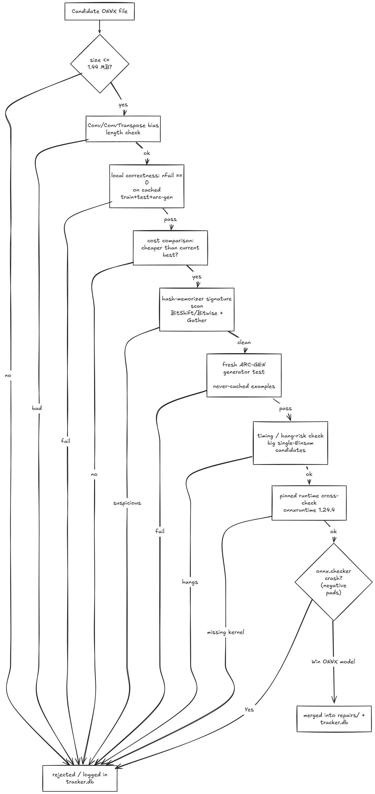
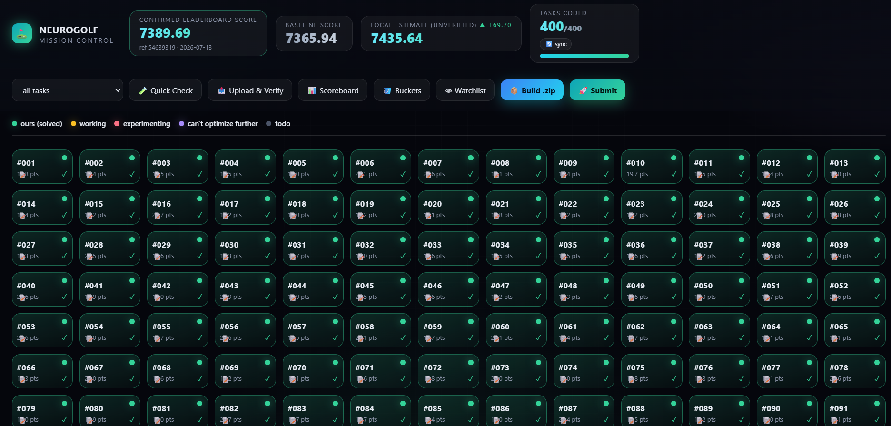
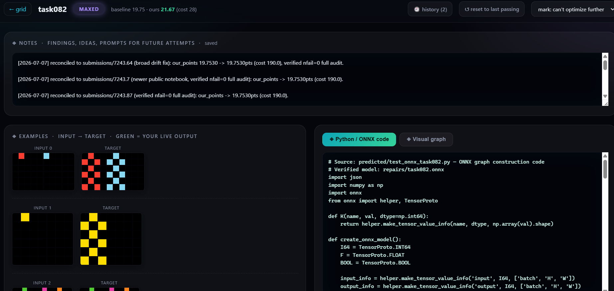
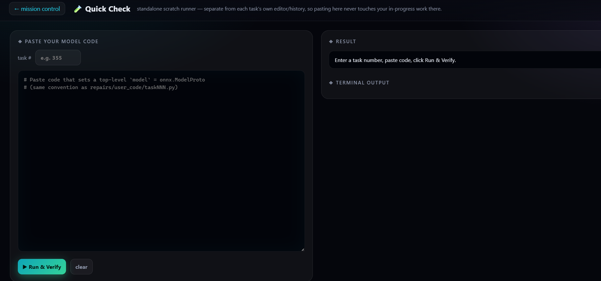
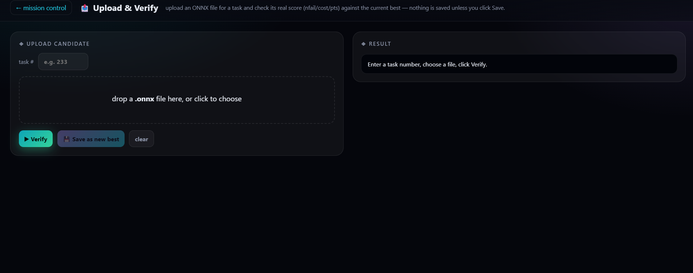
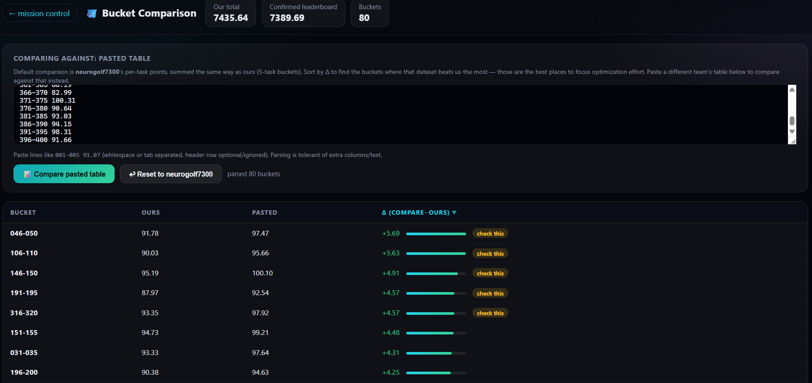

# The 2026 NeuroGolf Championship

Solutions and tooling for [NeuroGolf 2026](https://www.kaggle.com/competitions/neurogolf-2026), a Kaggle competition where you build the smallest possible ONNX network that solves each of 400 ARC-AGI visual reasoning tasks. Score per task is `max(1, 25 - ln(memory + params))`, and a task only counts if the network is 100% correct on every train/test/arc-gen example: one wrong output zeroes the whole task.

**Final score: 7440.82** (rank 196/3059, bronze medal).

Want to learn ONNX from this project instead of just the results? `docs/onnx-learning-guide.html` is a from-scratch tutorial covering the basics, how NumPy/math map to ONNX ops, every op family used here, and the real bugs we hit along the way. For the short version (workflow, what worked, what went wrong) see `docs/SOLUTION_WRITEUP.md`.

## Layout

```
data/              Task definitions (task001.json ... task400.json) + the official scorer
repairs/           Our best ONNX file per task (400 files) + tracker.db (state/cost/notes per task)
  user_code/         Per-task Python source that builds/repairs each graph
other_model_onnx/  Candidate files (ours or found elsewhere) waiting on or after review
webapp/            Flask tracker app: browse/edit/audit tasks, build + submit
scripts/           Analysis and audit scripts
arc_dsl_ref/       Reference ARC-DSL solvers used to cross-check task rules
*.ipynb            Working notebooks
```

## How a task gets solved

1. Work out the transformation rule from the train/test examples.
2. Build or repair an ONNX graph that implements it, within the competition's constraints (static
   shapes, no `Loop`/`Scan`/`NonZero`/`Unique`/`Compress`/subgraphs).
3. Audit it for real: run the exact scorer logic (`sanitize_model` + `score_network`,
   `onnx.checker.check_model(full_check=True)`, every train/test/arc-gen example) on the pinned
   `onnxruntime` version. Only a 100% pass counts.
4. If it beats the current best for that task, merge it into `repairs/` and note why in `tracker.db`.

The full gate sequence a candidate has to clear before step 4, in order:



### Webapp

The webapp wraps this in a UI: edit a task, see the audit run live, browse history, and build the
final `submission.zip` (always assembled from the best verified file per task).

```
cd webapp && docker compose up -d --build   # -> http://localhost:5000
```

Mission control, all 400 tasks at a glance:



Per-task editor, code, live examples, and notes side by side:



Quick Check, a standalone scratch runner, separate from a task's saved history:



Upload & Verify, score a candidate `.onnx` file before deciding whether to keep it:



Bucket comparison, paste another team's per-task scores to find where they're beating us:



## Workflow

Two AI collaborators, each doing a different job: ChatGPT generated the ONNX candidates and
optimization code per task, Claude Code built the audit tooling and ran the merge discipline.
Budget was $20 on each. Full detail (the exact per-task loop, task selection, why only ~150 of
the 400 got the full treatment) is in `docs/SOLUTION_WRITEUP.md`.

- One canonical state (`repairs/` + `tracker.db`), never edited by hand; every change went
  through the same audit pipeline before it was allowed in.
- Candidates came from hand-built graphs, our own earlier attempts, and public notebooks/datasets
  from the forum, all held to the identical verification bar.
- Task *selection* came from the bucket comparison page (where another team's scores beat ours
  the most) and from the
  [community discussion thread](https://www.kaggle.com/competitions/neurogolf-2026/discussion/708377)
  (thanks to Fritz Cremer for the realistic ~3-5-tasks-per-5-hour-window estimate that shaped
  prioritization).
- Kept two live submission lines near the deadline: one aggressive, one fully de-risked.

## Novel ideas that moved the needle

A few of the largest task-level wins, out of ~+17.9 points total across everything found this way
(full list with every task and delta in `docs/SOLUTION_WRITEUP.md`):

- Collapse the entire rule into one direct-to-output Einsum: task303 cost 1450→68 (+3.060)
- Use the input itself as a dynamic convolution kernel: task082 cost 190→28 (+1.915)
- Factor dense channel-routing matrices into low-rank codes: task304 cost 1320→260 (+1.625)
- Bit-pack spatial state instead of materializing masks: task034 cost 2072→645 (+1.167)
- Three tasks (067, 179, 241) hit the theoretical max of 25 points via a zero-param,
  direct-output template.

## What actually moved the score

Cost is `memory + params`, then `25 - ln(cost)`. It's log-scaled, so halving a cost is worth the
same points whether it started at 60 or 60,000: cheap-looking tasks aren't low priority.

- **Quantize counting/matching ops.** `QLinearConv` emits `uint8` instead of float32, a free 4x cut.
- **Cut dead initializer data.** Zero-value Conv channels, duplicate constants, both roughly halve cost.
- **Collapse into one `Einsum`.** Removes every charged intermediate tensor between input and output.
- **Check attribute-only opset variants.** `Upsample` avoids the tensor-input cost `Resize` charges.
- **Cheaper op isn't a cheaper graph.** The intermediate tensor between two ops can dominate cost.
- **`params` counts elements, not bytes.** Use `uint8`/`int8` for large intermediate tensors specifically.

## Lessons that cost real points to learn

- **A clean local pass isn't proof.** Cached examples don't cover what the real grader checks.
- **Node count isn't cost.** Byte size is what's actually charged, not op count.
- **Re-audit fresh, never trust a cache.** Stale `tracker.db` values caused every regression we hit.
- **Negative-pad models are a special case.** Local checker fails, real grader often scores fine.
- **Watch Conv/ConvTranspose bias length.** Out-of-bounds read corrupts results silently on Kaggle's grader.
- **Use the official conversion function.** A hand-rolled check produces false failures on oversized grids.
- **Batch score mismatch? Suspect your setup.** Contaminated base folders, not real per-task interactions.

## Setup

```
python -m venv .venv && .venv/Scripts/pip install -r requirements.txt   # onnxruntime==1.27.0, main dev env
```

Kaggle's real grader runs a different, older `onnxruntime==1.24.4`, which is missing some kernels
the newer version has (see the `TopK` lesson above). Before trusting any candidate, it also gets
checked in a second venv pinned to that exact version:

```
python -m venv venv_scorer && venv_scorer/Scripts/pip install onnxruntime==1.24.4 onnx numpy
```

That second venv isn't committed; recreate it locally if you need it.

To submit, configure the Kaggle CLI (`kaggle.json`), then submit directly from the webapp or via
`scripts/`.

## Citation

```
boltuzamaki, "The 2026 NeuroGolf Championship", 2026.
https://github.com/Boltuzamaki/The-2026-NeuroGolf-Championship
```

## License

[MIT](LICENSE)
