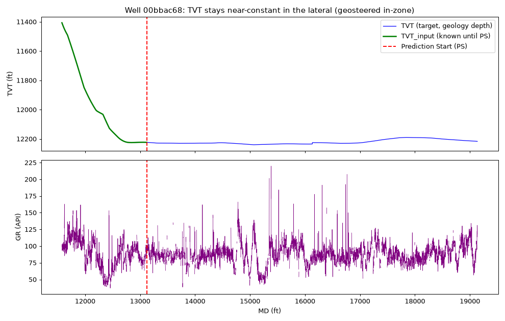
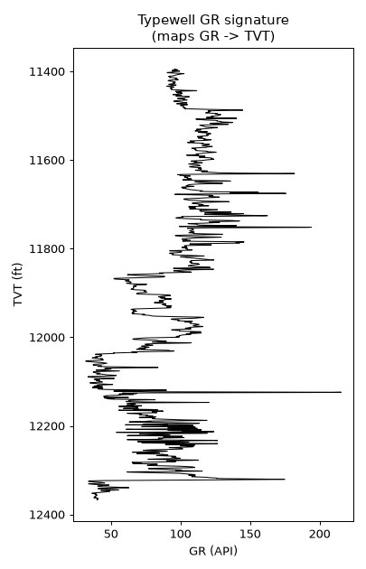
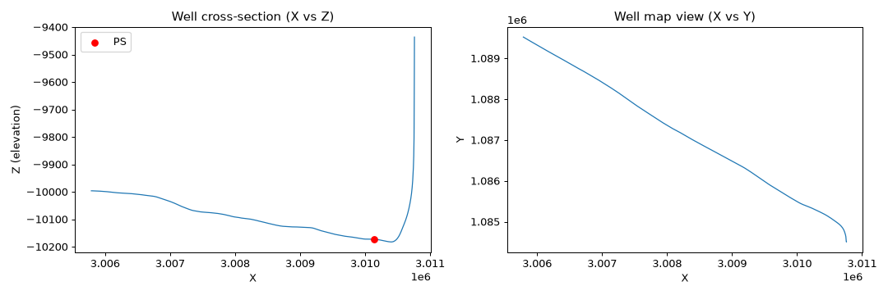

# ROGII – Wellbore Geology Prediction

Geosteering ML challenge: predict the **geology (TVT)** along the horizontal
section of a well from its Gamma-Ray log and trajectory, using a nearby
vertical reference well.

---

## 1. The goal (in plain terms)

When drilling a **horizontal well**, the bit travels for thousands of feet
roughly inside one rock layer. Engineers need to know, at every point, **where
the bit sits inside the geological column** — i.e. its **TVT (True Vertical
Thickness)**: the equivalent vertical depth in the rock stratigraphy.

- TVT is **measured/known up to the *Prediction Start* (PS) point** (≈ first
  25 % of the well — the vertical + build section).
- **Our job: predict TVT for every point *after* PS** (the lateral), using only
  data available there.

> Evaluation = **RMSE** of `dTVT = manualTVT − predictedTVT` over all predicted
> points (one prediction per foot of MD).

### How TVT is inferred (the physics)
A **typewell** (a nearby vertical well) gives the reference **GR → TVT
signature**. As the horizontal bit crosses layers, its **GR signature**
goes up/down; matching that signature against the typewell tells you whether the
bit is moving up or down in the geology (i.e. the TVT). Neighboring/offset wells
share dip behaviour, so the geology of one well helps predict another.

---

## 2. The data

```
data/
├── sample_submission.csv         # id = <well>_<rowindex>,  tvt = value to predict
├── train/   (773 wells)
│   ├── <well>__horizontal_well.csv
│   ├── <well>__typewell.csv
│   └── <well>.png                # reference plot (not used by the model)
└── test/    (3 wells)
    ├── <well>__horizontal_well.csv
    └── <well>__typewell.csv
```

**`<well>__horizontal_well.csv`** — one row per foot of measured depth (MD):

| col | meaning | in test? |
|-----|---------|----------|
| `MD` | measured depth (well length, ft) | ✅ |
| `X,Y,Z` | coordinates of each point (Z = elevation) | ✅ |
| `GR` | gamma-ray at each point (some NaN) | ✅ |
| `TVT_input` | known TVT **up to the PS point**, then **NaN** | ✅ |
| `TVT` | **TARGET** — full TVT curve | ❌ train only |
| `ANCC, ASTNU, …, BUDA` | formation top depths (markers) | ❌ train only |

**`<well>__typewell.csv`** — the vertical reference well:

| col | meaning | in test? |
|-----|---------|----------|
| `TVT` | vertical depth | ✅ |
| `GR` | gamma-ray vs TVT (the reference signature) | ✅ |
| `Geology` | layer name (ANCC, ASTNU, …) | ❌ train only |

**Submission** = exactly the rows where `TVT_input` is NaN
(`id = <well>_<rowindex>`, `tvt = predicted TVT`). 14 151 rows over 3 test wells.

---

## 3. Key EDA findings (these drive the model design)



1. **PS = the first NaN in `TVT_input`.** It marks the start of the lateral and
   sits at ~25 % of the well on average; ~75 % of each well must be predicted.
2. **TVT is strongly mean-reverting in the lateral.** The well is *actively
   geosteered to stay in zone*, so after PS the TVT only wanders ≈ **30 ft
   (median range)** around its PS value, with **net drift ≈ 0**.
3. **Therefore the “hold-TVT-constant-at-PS” baseline is very strong**
   (per-well RMSE ≈ **12.8 ft**). Every naive physics extrapolation we tried is
   *worse*:
   | method | per-well RMSE |
   |--------|---------------|
   | flat geology (TVT = −Z + c) | 96 |
   | linear TVT-vs-MD trend | 61 |
   | TVD-dip extrapolation | 28 |
   | **constant @ PS** | **12.8** |
4. **GR carries the real signal but is ambiguous point-wise.** Naive nearest-GR
   matching (21 ft) and free DTW signature alignment (23 ft) both *drift away*
   and lose to constant — the geology is too flat for unconstrained correlation.
   → The winning move is **small, regularized corrections to the constant
   anchor**, not free-form inversion.
5. `GR` has ~**28 %** NaN → must interpolate/smooth.

 

---

## 4. Baseline model (strong, not a one-liner)

A **LightGBM** gradient-boosted regressor that predicts the **anchored target
`dTVT = TVT − TVT_PS`** (well-agnostic, mean ≈ 0), then adds it back to the PS
anchor.

**Features** (all relative to PS so they generalise across wells):
`d_md, d_z, d_x, d_y, horiz_disp, dz/dmd`, GR & smoothed GR (15/51-pt medians),
GR gradient & rolling std, `GR − GR_PS`, **`gr_impl_d`** (typewell GR→TVT match
candidate), `GR − typewell_GR@PS`, typewell GR slope, and fraction-along-lateral.

**Regularisation that matters:** large `min_child_samples`, then **shrink
predictions ×0.5 and clip to ±40 ft** (tuned on OOF) — this encodes “stay near
the in-zone anchor”.

### Validation (5-fold GroupKFold by well)

| metric | constant @ PS | **LightGBM baseline** |
|--------|--------------:|----------------------:|
| per-well mean RMSE (ft) | 12.81 | **12.10** |
| beats constant in | — | **65 % of wells** |

A genuine, cross-validated improvement over the strong constant baseline.

---

## 5. How to run

```bash
# local
python cv_validate.py        # 5-fold GroupKFold validation
python make_submission.py    # trains on all 773 wells -> submission.csv

# Kaggle (code competition: must submit a notebook's output)
#   1. push notebooks/wellbore_baseline.ipynb to your account
#   2. submit its submission.csv:
kaggle competitions submit -c rogii-wellbore-geology-prediction \
    -f submission.csv -k boltuzamaki/<NOTEBOOK> -v <VERSION> -m "LGBM dTVT baseline"
```

| file | purpose |
|------|---------|
| `wellbore_lib.py` | shared IO + feature engineering + model config |
| `cv_validate.py` | GroupKFold CV vs constant baseline |
| `make_submission.py` | train on all data → `submission.csv` |
| `notebooks/wellbore_baseline.ipynb` | self-contained Kaggle notebook (EDA + model) |

---

## 6. Where to go beyond baseline
- **Offset-well dip priors** — use neighbouring wells' dip (slides 12–13) since
  dip is spatially correlated.
- **Sequence model** (1-D CNN / GRU) over GR to learn signature→ΔTVT directly.
- **Constrained DTW** between horizontal GR and typewell GR with a tight
  in-zone band + monotonic penalty.
- Per-well shrink chosen by how informative the typewell GR signature is.
